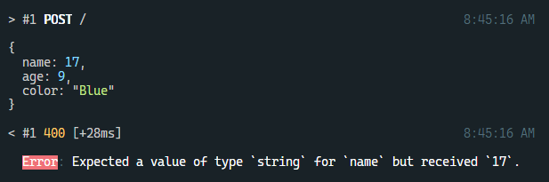

# micro-superstruct [](https://travis-ci.org/brandon93s/micro-superstruct)

> A [Superstruct](https://github.com/ianstormtaylor/superstruct) wrapper for [Micro](https://github.com/zeit/micro) to validate your request body and query parameters.

## Install

```shell
npm install micro-superstruct
```

## Usage

micro-superstruct exports a validate function that allows you to create API validators from any `Struct`:

```js
const {object, string, number} = require('superstruct')
const {json, send} = require('micro')
const validate = require('micro-superstruct')

// define a Superstruct `Struct`
const Unicorn = object({
  name: string(),
  age: number(),
  color: string()
})

// create a validator
const validator = validate(Unicorn)

// write your Micro API
const handler = async (req, res) => {
  const body = await json(req)
  send(res, 200, body)
}

// export validated service
module.exports = validator(handler)
```

Requests that fail validation will return a 400 error along with a Superstruct validation message:



## API

### validate(config)

Returns a validator function that can be used to validate a Micro handler.

#### config
Type: `Struct | object`

Passing a `Struct` directly will configure request body validation using the provided validator.

Passing an `object` allows for validation of both the request body and query string. Both are optional.

```js
// body validation
validate(object({}))

// body and/or query validation
validate({
  body: object({}),
  query: object({})
})
```

## License

MIT © [Brandon Smith](https://github.com/brandon93s)
